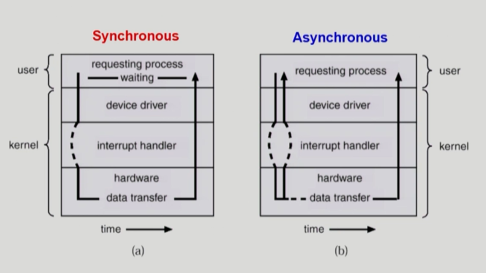
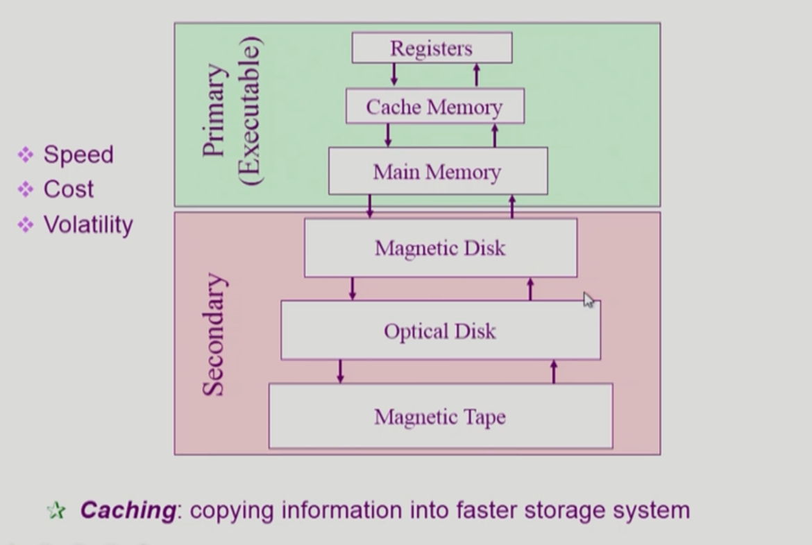

# System Structure & Program Execution 

## 컴퓨터 시스템 구조

컴퓨터는 CPU로 이루어진 컴퓨터와 I/O device들로 구성되어 있음  

 

 

### CPU

메모리에서 인스트럭션을 하나씩 읽어서 수행하는 역할  

CPU는 항상 메모리에 있는 인스트럭션을 실행하는 역할만 하기 때문에 메모리에서만 작업을 함  

하지만 컴퓨터를 사용하다 보면 디스크에서 읽어오거나 키보드의 입력을 받거나 화면에 출력하는 등 I/O device에 접근하는 행동이 필요함  

만약 특정 프로그램에서 Disk를 읽어서 데이터를 받은 후 처리해야 하는 경우 CPU는 직접 Disk에 접근하지 않고 device controller에 데이터를 요청하는 명령을 보냄 
이후 CPU는 데이터를 기다리면서 다른 작업을 진행하다가 입출력 데이터가 전송되면 interrupt를 걸게 됨 
interrupt가 걸리면 CPU 제어권이 운영체제로 넘어감
운영체제에서 데이터를 요청한 사용자 프로그램에 데이터를 전송하고, CPU를 사용 중이었던 사용자 프로그램에 다시 CPU를 넘겨줌

 

#### registers

CPU 안에 있는 공간으로 메모리보다 빠르면서 데이터를 저장할 수 있는 공간

 

#### mode bit

사용자 프로그램의 잘못된 수행으로 다른 프로그램 및 운영체제에 피해가 가지 않도록 하기 위한 보호장치로 CPU에서 실행되는 것이 운영체제인지 사용자 프로그램인지 구분해주는 역할  

Mode bit을 통해 하드웨어적으로 두 가지 모드의 operation 지원

+ 1 : 사용자 모드로 사용자 프로그램이 수행되는 경우
  + 제한된 인스트럭션만 CPU에서 실행
+ 0 : 모니터 모드(= 커널 모드, 시스템 모드)로 OS 코드가 수행되는 경우
  + 무슨 일이든 다 할 수 있게 정의되어 있음 (메모리 접근, 입출력장치 접근 등)

 

보안을 해칠 수 있는 중요한 명령은 모니터 모드에서만 수행 가능한 **특권 명령**으로 규정 (보안 목ㅂ적)

Interrupt나 Exception 발생 시에는 하드웨어가 mode bit을 0으로 바꾸고, 사용자 프로그램에게 CPU를 넘기기 전에는 mode bit을 1로 바꿈

 

#### Interrupt line

CPU는 하나의 인스트럭션 처리가 끝나면 Interrupt line을 확인하고, Interrupt가 존재하지 않는 경우 다음 인스트럭션을 실행  

Interrupt line이 존재하는 경우 CPU는 하던 일을 멈추고 CPU의 제어권이 사용자 프로그램으로부터 운영체제로 넘어가게 됨

운영체제가 CPU를 얻게 되면 다음 프로그램에 CPU를 넘겨주고 timer에 시간을 세팅함

 

### Memory

CPU의 작업 공간

CPU는 매 순간(클럭사이클)마다 메모리에서 기계어를 하나씩 읽어서 실행하게 됨  

 

### I/O device

별개의 디바이스들의 집합  

Input : I/O device의 데이터가 컴퓨터 안으로 들어가는 것 (Input device : 키보드)

Output : 데이터를 받아서 처리한 결과를 I/O device로 내보내는 것 (Output device : 모니터, 프린터)  

하드디스크는 보조 기억장치이지만 I/O device라고 볼 수도 있음, 데이터를 읽어서 메모리로 읽어들이는 Input device의 역할도 하고, 처리 결과를 디스크에 저장하는 Output device의 역할도 함  

I/O 장치에 접근하는 모든 인스트럭션은 운영체제를 통해서만 할 수 있기 때문에 사용자 프로그램의 경우 I/O 장치에 직접 접근할 수 없음 따라서 I/O 작업이 필요한 경우 CPU를 운영체제에게 넘겨주고 운영체제가 I/O 장치에 작업을 요청함

 

#### device controller

각 I/O device는 해당 디바이스를 전담하는 작은 CPU가 붙어 있음 이것을 device controller라고 함 
해당 디바이스가 어떻게 움직이는지 등을 통제하는 것은 CPU의 역할이 아니라 device controller의 역할  

제어 정보를 위해 control register, status register를 가짐 (CPU가 일을 시킬 때 그 레지스터를 통해 무슨 일을 해라라고 지시하기 위한 것)  

I/O는 실제 device와 local buffer 사이에서 일어남

** device driver (장치 구동기) : OS 코드 중 각 장치 별 처리 루틴 (software)

** device controller (장치 제어기) : 각 장치를 통제하는 일종의 작은 CPU (hardware)

 

#### local buffer

Memory가 CPU의 작업 공간 역할을 하는 것처럼 device controller로 각자의 작업 공간이 필요함 device controller의 작업 공간 역할은 local buffer가 함 (일종의 data register)

 

### timer

특정 프로그램이 CPU를 독점하는 것을 막기 위한 하드웨어   

처음 컴퓨터를 켰을 때는 운영체제가 CPU를 가지고 있다가 여러 사용자 프로그램이 실행되면 해당 프로그램에게 CPU를 넘겨줌 이때 그냥 넘겨주는 것이 아니라 timer에 값을 세팅 후 넘겨줌  

해당 프로그램은 timer에 세팅된 시간만큼 CPU를 점유하고, 해당 시간이 지나면 timer가 CPU에 interrupt를 걸게 됨 (interrupt line)  

타이머는 매 클럭 틱 때마다 1씩 감소  

타이머는 time sharing을 구현하기 위해 널리 이용되며, 현재 시간을 계산하기 위해서도 사용됨

 

### DMA (Direct Memory Access) Controller

직접 메모리에 접근할 수 있는 컨트롤러
I/O 장치가 interrupt를 걸어서 CPU를 사용하는 것이 오버헤드가 너무 큼 따라서 이를 방지하기 위해 CPU는 자기 일을 하고, DMA Controller가 입출력장치를 통해 들어오는 데이터를 직접 메모리에 복사해주는 역할을 함 
복사하는 작업이 끝난 경우 CPU에게 interrupt를 한 번만 걸기 때문에 CPU가 interrupt 당하는 빈도를 줄여 효율적으로 사용 가능  

CPU와 DMA Controller가 같은 메모리에 동시에 접근하는 경우 문제가 생길 수 있기 때문에 memory controller가 이를 중재함

- 빠른 입출력 장치를 메모리에 가까운 속도로 처리하기 위해 사용 (CPU에 많은 인터럽트가 걸리는 것을 방지하기 위함)
- CPU의 중재 없이 device controller 가 디바이스의 buffer storage의 내용을 메모리에 block 단위로 전송시켜 바이트 단위가 아니라 block 단위로 인터럽트를 발생시킴

 

## 입출력(I/O)의 수행

모든 입출력 명령은 특권 명령임  

사용자 프로그램이 I/O를 하는 방법

+ 시스템 콜(system call) : 사용자 프로그램이 운영체제에게 I/O를 요청하는 것(커널 함수 호출)으로 프로그램이 직접 interrupt를 거는 방식으로 수행됨
+ trap을 사용하여 인터럽트 벡터의 특정 위치로 이동 (소프트웨어 인터럽트)
+ 제어권이 인터럽트 벡터가 가리키는 인터럽트 서비스 루틴으로 이동
+ 올바른 I/O 요청인지 확인 후 I/O 수행
+ I/O 완료 시 제어권을 시스템콜 다음 명령으로 옮김 (하드웨어 인터럽트)

 

## 인터럽트 (Interrupt)

현대의 운영체제는 인터럽트에 의해 구동됨

인터럽트 당한 시점의 레지스터와 program counter를 저장한 후 CPU의 제어를 인터럽트 처리 루틴에 넘김

- Interrupt (하드웨어 인터럽트) : 하드웨어가 발생시킨 인터럽트
- Trap (소프트웨어 인터럽트)
  - Exception : 프로그램이 오류를 범한 경우 (ex. 0으로 나누는 연산)
  - System call : 프로그램이 커널 함수를 호출하는 경우

 

### 인터럽트 관련 용어

#### 인터럽트 벡터

해당 인터럽트의 처리 루틴 주소를 가지고 있음  

각 인터럽트 종류마다 해당 인터럽트가 들어오는 경우 어디 있는 함수를 실행하여야 하는지에 대한 정의

 

#### 인터럽트 처리 루틴 (= Interrupt Service Routine, 인터럽트 핸들러)

해당 인터럽트를 처리하는 커널 함수

실제로 인터럽트를 처리하는 부분이며 해당 인터럽트를 어떻게 처리해야 하는지 정의되어 있음

 

## 동기식 입출력과 비동기식 입출력

동기식 입출력과 비동기식 입출력은 모두 I/O가 끝나면 인터럽트로 알려줌

 

### 동기식 입출력 (synchronous I/O)

I/O 요청 후 입출력 작업이 완료된 후에야 제어가 사용자 프로그램에 넘어가는 것으로 주로 읽기에 사용

구현 방법

1. I/O가 끝날 때까지 CPU가 낭비되고, 매 시점 하나의 I/O만 일어날 수 있음 (I/O 장치도 낭비)
2. I/O가 완료될 때까지 해당 프로그램에게서 CPU를 빼앗고 I/O 처리를 기다리는 줄에 그 프로그램을 줄 세운 후 다른 프로그램에게 CPU를 줌 (CPU와 I/O 장치의 낭비를 줄일 수 있음)

 

### 비동기식 입출력 (asynchronous I/O)

I/O가 시작된 후 입출력 작업이 끝나기를 기다리지 않고 제어가 사용자 프로그램에 즉시 넘어가는 것으로 주로 쓰기에 사용

읽어온 데이터와 상관없이 다른 작업을 진행 

 

## 서로 다른 입출력 명령어

일반적인 I/O 방식 : 메모리만 접근하는 인스트럭션, I/O만 접근하는 인스트럭션(I/O를 수행하는 special instruction)이 따로 존재함 (메모리 주소처럼 I/O에도 별도로 접근할 수 있는 주소가 있음)

Memory Mapped I/O : I/O 주소에 메모리 주소를 매겨서 메모리에 접근하는 방식으로 I/O에도 접근하는 방식

 

## 저장장치 계층 구조

|     저장장치 계층 구조      |
| :-------------------------: |
|             CPU             |
|             ↓ ↑             |
|          레지스터           |
|             ↓ ↑             |
|        Cache Memory         |
|             ↓ ↑             |
| Main Memory (DRAM으로 구성) |
|             ↓ ↑             |
|        Magnetic Disk        |
|             ↓ ↑             |
|        Optical Disk         |
|             ↓ ↑             |
|        Magnetic Tape        |

위로 갈수록 속도가 빠르지만 가격이 비싸기 때문에 용량이 적음

Primary : 휘발성 매체로 구성, CPU가 직접 접근 가능 (byte 단위로 접근, Executable)

Secondary : 비휘발성 매체로 구성, CPU가 직접 접근 불가능 (섹터 단위로 접근)

캐싱 : 빠른 매체로 정보를 읽어들여 쓰는 것으로 재사용을 목적으로 함 (데이터의 반복 사용 시 속도가 빨라짐)

 

## 프로그램의 실행 (메모리 load)

파일 시스템에 저장되어 있던 실행파일이 실행되면 프로세스가 됨

프로그램을 실행시키면 물리적 영역에 바로 올라가는 것이 아니라 Virtual memory에 먼저 올라감 그 프로그램만의 독자적인 주소 공간이 생김 해당 주소 공간은 code, data, stack 공간으로 구성됨 이것을 물리적은 메모리에 올려서 실행하는 것

현재 실행되는 프로그램의 주소 공간에 있는 모든 것이 물리적인 메모리에 올라가는 것이 아니라 프로그램 실행에 당장 필요한 부분만 메모리에 올림 (메모리의 낭비를 막기 위함) 이때 물리적 공간에 올라가지 못한 주소 공간은 swap area에 보관됨 따라서 독자적인 주소 공간은 실제로 어딘가에 존재하는 것이 아니기 때문에 virtual memory라고 부름

swap area : 메모리의 연장 공간 용도로 사용되는 공간

Address translation : 하드웨어의 지원을 받아 논리적인 메모리 주소를 물리적인 메모리 주소로 바꿈

 

## 커널 주소 공간의 내용

커널도 프로그램이기 때문에 code, data, stack 영역이 존재

- code
  - 시스템 콜, 인터럽트 처리 코드
  - 자원 관리를 위한 코드
  - 편리한 서비스 제공을 위한 코드
- data
  - 운영체제가 사용하는 여러 자료 구조 정의 (CPU, mem, disk, PCB 등)
- stack
  - 함수를 호출하거나 리턴할 때 사용되는 영역
  - 사용자 프로그램마다 커널 스택을 따로 둠

 

## 사용자 프로그램이 사용하는 함수

함수 (function)

- 사용자 정의 함수 : 자신이 프로그램에서 정의한 함수
- 라이브러리 함수 : 자신의 프로그램에서 정의하지 않고 갖다 쓴 함수로 자신의 프로그램의 실행 파일에 포함되어 있음
- 커널 함수 : 운영체제 프로그램의 함수로 커널 함수가 호출되면 시스템 콜이 됨 (위의 두 함수와 다르게 내 프로그램 안에 들어있는 함수가 아님)

 

## 프로그램의 실행 순서

1. user mode (프로그램이 CPU를 잡고 있는 시간, 프로그램의 주소 공간)
2. System call
3. kernel mode (커널의 주소 공간)
4. System call 종료
5. user mode
6. 사용자 정의 함수 호출

프로그램은 user mode와 kernel mode를 반복하다가 종료됨
